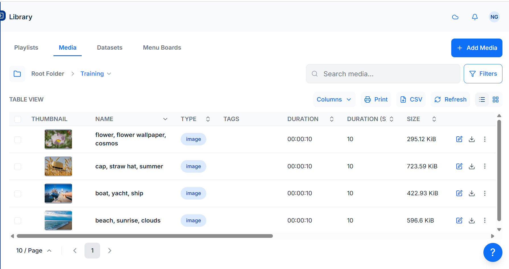
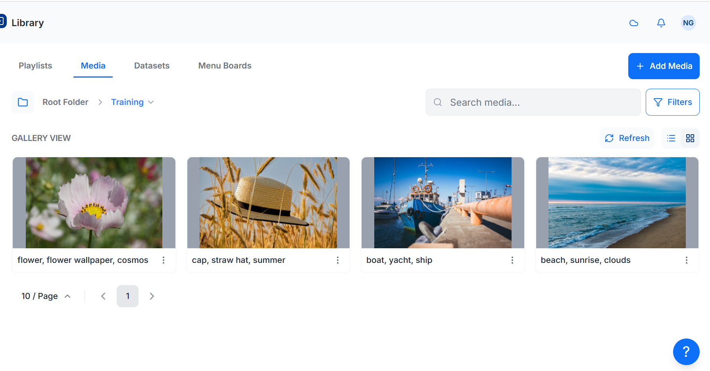

# Media Library 

[[PRODUCTNAME]] supports a wide variety of media types, from Widgets which are created and stored directly on Layouts and Playlists to file-based media that is uploaded and stored in the CMS Library which can then be reused across multiple Layouts and Playlists.

{version}
**NOTE:** [[PRODUCTNAME]] takes no measures to control what content is put on your Displays. It is your responsibility to ensure that your content is appropriate material for your desired audience. Content must be appropriately attributed if you do not own the rights to it.
{/version}

Manage all file based media by selecting **Media** under the **Library** section of the main CMS menu.

Use the buttons on the right hand side of the grid to switch between a **grid** or **thumbnail** view:

Use the **Filters** button to apply filters to restrict criteria for returned results.

{tip}
Use the **OR/AND** option for **Names** and to filter items that have been assigned multiple **Tags**.

Images and Videos that have a set thumbnail can also be filtered by **Orientation** once set:

1. Use the row menu for the item and select **Edit** for an Image/Video file  

2. Scroll down to the bottom of the form and set the intended **Orientation**

{/tip}

## Adding Library Media

Library media is added using the **Add Media** button to either drag and drop files, using **Select Files** to upload or by providing a **URL**.

{tip}
Add Media to the CMS Library and save to Folders to have media ready for use for the appropriate Users/User Groups!

Files added to the CMS Library can be easily added to Layouts and Playlists using a [Library Search](layouts_editor_library_search)
{/tip}

### Add Media

- Select the **Add Media** button

- Use the drop down to select an alternative folder location if required

- Drag and drop files or click **Select Files** or provide the remote URL for the file

- Files will start automatically uploading

- Files can be re-named or leave blank to keep the original file naming

- Click **Done** once added and the files will continue to upload in the background

  {tip}
  Default thresholds and limits can be specified which are then considered in the event an [Image](media_module_image.html) should be resized when uploading an image for example. Further information can be found in **CMS Settings**.
  {/tip}

## Row Menu

Each item in the **Library** has a row menu where Users can access a list of actions/shortcuts

## Edit

Select **Edit** to make changes to **Folder** locations, **Durations** and **Tags** and other settings.

- Notable settings are listed below:

### Expiry Dates

Set an Expiry Date for Library Media to remove the file from any Layouts/Playlists it has been used on. 

### Retire Media

Ticking **Retire this Media** will keep the media file assigned to any existing Layouts/Playlists but will not be made available for further selection to add to Layouts/Playlists.

### Enable Media Stats Collection

- Set the collection of [Proof of Play](displays_metrics.html#proof_of_play) statistics to On / Off / Inherit for the selected media file.

{tip}
Ensure that **Enable Stats Reporting** has been ticked in Display Settings in order to collect Proof of Play stats!
{/tip}

### Update Media

Use the check box **Update this Media in all Layouts it is assigned to** so that any edits are reflected in Layouts/Playlists that this media file is currently assigned to. 

{tip}
Edits will only be updated in Layouts/Playlists which you have access to edit!
{/tip}

### Replace File

It may be necessary to upload a new revision of an existing file:

- Click **Select File** and choose the media file to replace the existing

- Optionally select to:

  - **Delete** the old file version completely from the CMS
  -  **Update** the replacement file to all Layouts/Playlists it is currently assigned to.

  

## Delete

Media files can only be deleted from the CMS if they are **not** being used on any existing **Layouts/Playlists**.

{version}
The option to force a delete must be used with caution as deleting a file cannot be reversed.
{/version}

{tip}
[Retiring Content](media_library.html#content-retire-media) rather than deleting it will keep the media file in any existing Layouts/Playlists it has been assigned to, with any scheduled content unaffected. Media will not be available to add to any new Layouts/Playlists.
{/tip}

- Tick in the box to enable a hard push using XMDS to completely remove the file from a Players local storage.

### Usage Report

{tip}
This report is great to use to make final checks prior to tidying media files!
{/tip}

This will show if the selected **media file** is directly assigned/scheduled to **Displays**. 

- Use the Layout tab to see what **Layouts** the media file is currently included in. 

### Schedule

Image and Video Library media files can be directly Scheduled to a Display as full screen content from the row menu.

## Tidy Library

As the CMS is used and Layouts/Playlists and Media are added, over time the Library can become cluttered with old content that is no longer in use.

The Library can be *tidied* by a User or Super Administrator so that it is kept clean and small. 
**Actions cannot be reversed so this must be used with caution.**

{tip}
This might be particularly useful if the CMS is installed on a web server that has quotas or if Users have been assigned their own quotas!
{/tip}

There are two places where the Library can be tidied:

1. From **CMS Settings**, **General** section - available to all Super Administrators only.
2. From the **Library**  - for all Users when **Enable Library Tidy** is ticked.

{nonwhite}
{cloud}
The Tidy Library function is turned off by default for **Xibo Cloud Hosting** customers as it can be potentially destructive if the options are not fully understood. Use the checkbox to enable if required.
{/cloud}
{/nonwhite}

Once enabled Users can click on a **Tidy Library** button located at the top of the Library page.

The form will show the number of files that will be deleted and how much space those files take up.

{tip}
This will only delete files that are owned by the logged in User which are no longer in use on a Layout or Assigned to a Display Group/Display.
{/tip}

#### Next...

[Modules and Connectors](media_modules.html)