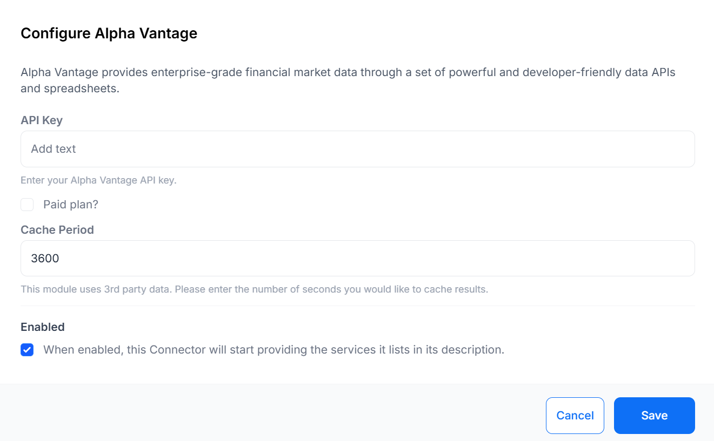

# Connectors Management

From the Connectors page under the Administration section of the main CMS menu, view all third party services which can be enabled and configured.

Click Configure for a Connector to Enable/Disable and to provide configuration options.

{cloud}
API keys are configured as part of the service for all modules that rely on a third party service.
{/cloud}

{noncloud}
You will need to create an account and obtain an API key for the third party service you wish to use and provide those details in the relevant Connector. 
{/noncloud}

