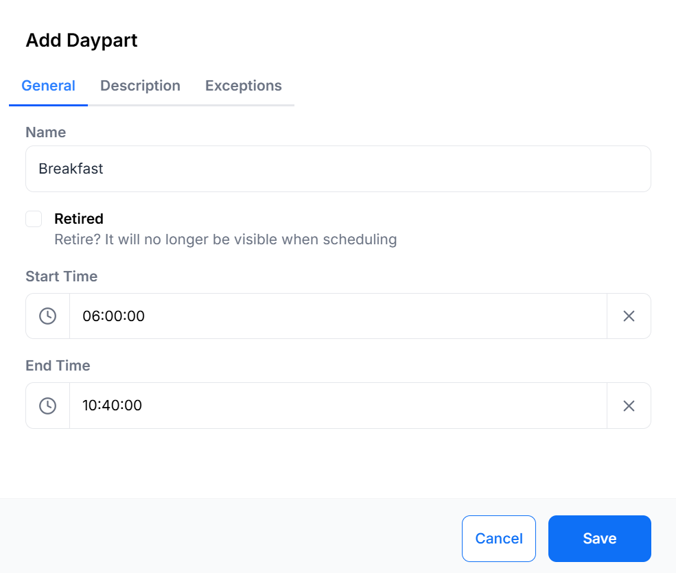
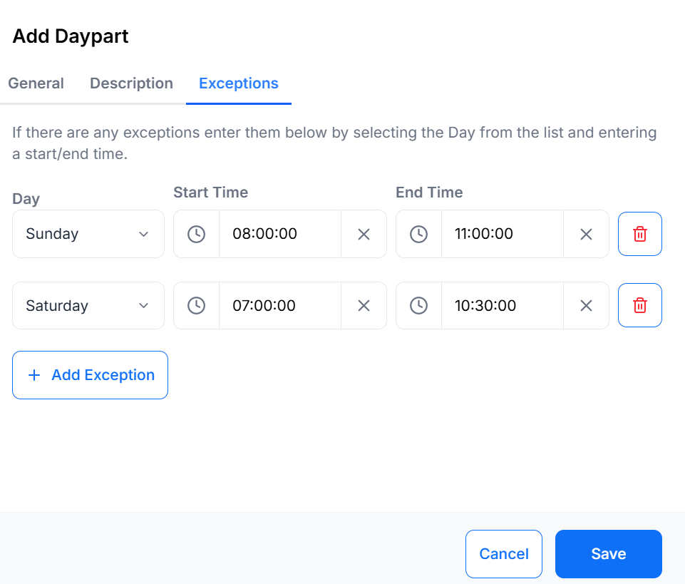

# Dayparting

Dayparting allows Displays to show relevant content based on the immediate needs of your audience allowing you to tailor content without manual intervention.

[[PRODUCTNAME]] supports the creation of multiple Dayparts, to allow you to define distinct blocks of time (e.g. Breakfast, Lunch, Evening) which can include defined exceptions. This means that a single day can be split into as many **pre-defined** parts as necessary.
{tip}
A typical use case would be a hospitality User who has different content to display for Breakfast, Lunch and Dinner. Dayparting allows that User to create a Breakfast, Lunch and Dinner daypart, each of which starts and ends on a different day, simplifying day to day scheduling.
{/tip}

## Add Daypart

Dayparts are created and administered from **Dayparting** on the main CMS menu.

- Select the **Add Daypart** button.
- Complete the form fields to configure.

{tip}
Include **Exceptions** to define different start and end timings for selected days!
{/tip}

On Saving, the Daypart will be available for selection in the **Dayparting** drop down menu of the schedule form when adding an Event.

{tip}
The below Daypart form shows an example Breakfast Daypart:

Saturday and Sunday have been configured as exceptions so that breakfast starts and ends at different times on those days:

On Scheduling, the **Breakfast** Daypart will appear in the drop-down for selection. On selecting, the from/to date time selectors will change to date only selectors and the time will be taken from the Daypart configuration - according to the day of the week the Event occurs on.
{/tip}

## Edit Dayparts

Make edits to existing Dayparts using the row menu.

{tip}
Add Sharing options for Dayparts to Share with other Users/User Groups!

Updating the start/end times or exceptions for a Daypart will cause existing future events to be updated with the newly defined times.

Existing recurring Schedules, set to recur beyond the current time, will have new Schedules created to reflect the updated information.
{/tip}

## Further Reading

 [Creating Display Operating Hours](displays_settings.html#content-operating-hours).
