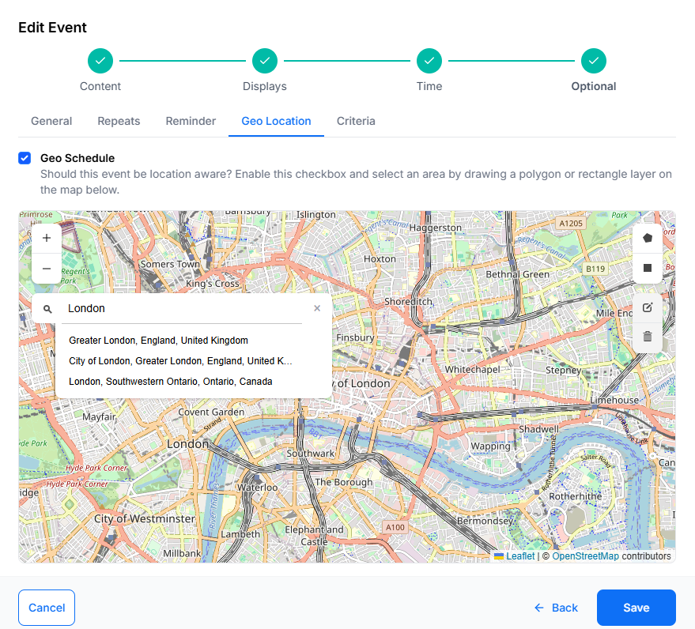
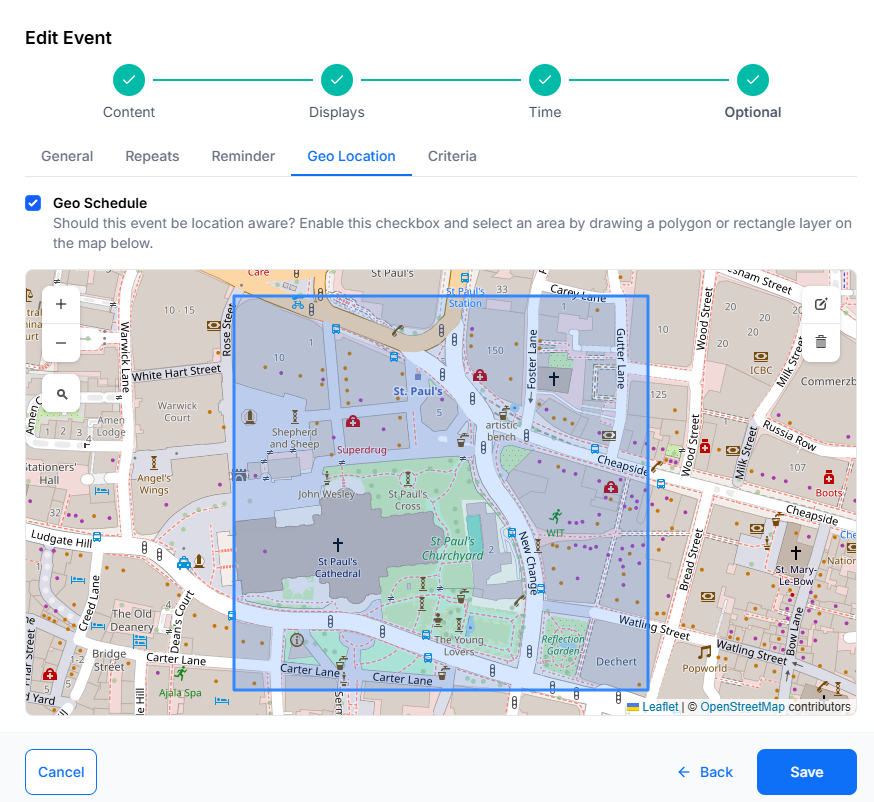
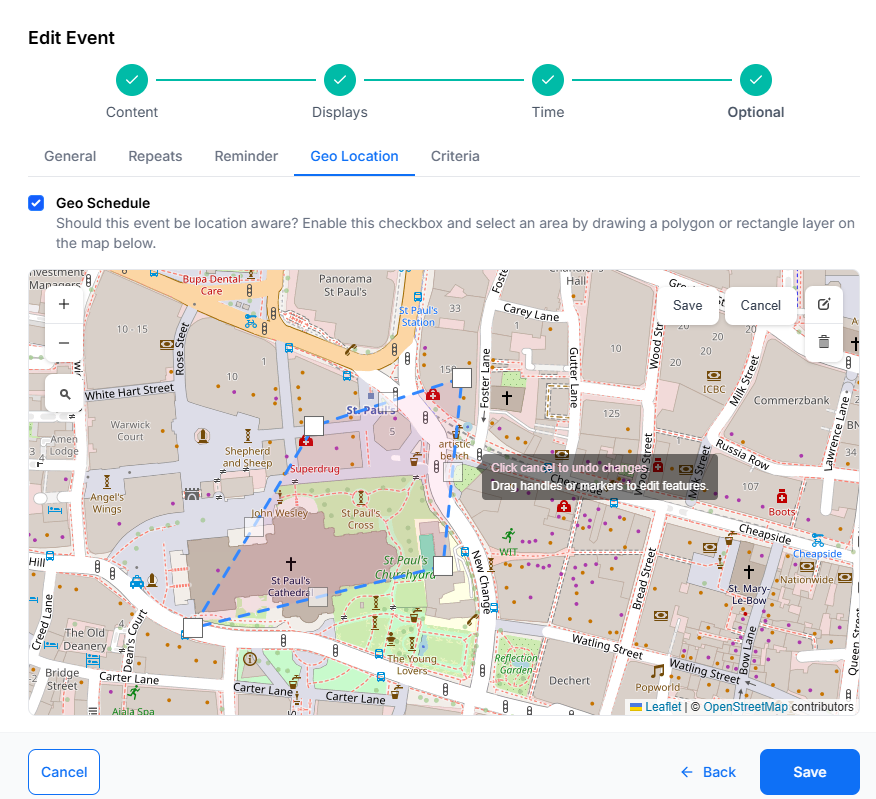

# Geo Scheduling

Scheduled Events can be configured to be location aware with locations displayed on a map view.

## Define Location

1. From the Add/Edit Event form, click on the **Optional** tab and select the **Geo Location** tab
2. Tick in the **Geo Schedule** box to enable and define the location

- Use the buttons in the top left of the map to Zoom in and out
- Click on the search icon to enter details for a particular area

{tip}
On opening, the map will default to what is entered for DEFAULT_LAT and DEFAULT_LONG in **CMS Settings**, under the Displays tab.
{/tip}

- Define an area by drawing a Polygon or Rectangle layer on the map.

## Edit

- Once an area has been defined, click on the edit icon, at the top right of the map, to to drag the markers to make adjustments to the existing Layer. 
- Click on the grey **Save** button located here to ensure that edits are saved.

## Delete

- To remove the area, use the bin icon and click into the area to delete
- Click the grey **Save** button to save the removal of the layer.

{tip}
Edit this schedule by clicking the icon in the Calendar or by using the row menu in the Grid view!
{/tip}

